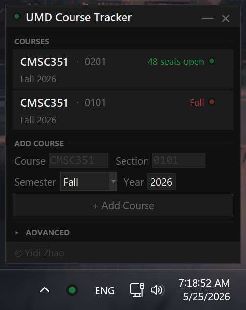
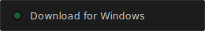

<div align="center">

# UMD Course Tracker

A Windows taskbar tray indicator that monitors UMD Testudo seat availability<br/>and notifies you the moment a seat opens.

<br/>



<br/><br/>

<a href="https://github.com/Yidiiiz/UMD-Course-Tracker/releases/latest/download/UMDCourseTracker.exe">
  
</a>

<sub>Windows 10 & 11 &nbsp;·&nbsp; No installation required &nbsp;·&nbsp; No Python needed</sub>

</div>

---

## What it is

UMD Course Tracker sits quietly in your taskbar as a small colored dot — green when seats are open, red when full. The moment a tracked section flips from closed to open, a Windows notification fires and clicking it takes you straight to the Testudo course page.

It is designed to live on your taskbar as a persistent indicator, not just run in the background.

---

## Getting Started

**1 — Download and run**

Download `UMDCourseTracker.exe` above and double-click it. Nothing to install.

**2 — Pin to your taskbar** *(important — do this first)*

Windows hides new tray icons in the overflow menu by default. To keep the tracker visible as a taskbar indicator:

- **Windows 11** — drag the dot icon out of the `∧` overflow area onto your taskbar
- **Windows 10** — right-click the taskbar → *Taskbar settings* → *Select which icons appear on the taskbar* → turn on **UMD Course Tracker**

**3 — Add your courses**

Left-click the tray icon to open the panel → enter a course ID (e.g. `CMSC351`) → pick a semester → **+ Add Course**

---

## Usage

| Action | How |
|:---|:---|
| Open panel | Left-click the tray icon |
| Add a course | Enter course ID + optional section, pick semester, click **+ Add Course** |
| Remove a course | Hover a card → click the **×** |
| Open on Testudo | Click anywhere on a course card |
| Tray icon | 🟢 Seats open &nbsp; 🔴 Full &nbsp; 🟡 Checking / error |

---

## Settings

Expand **Advanced** at the bottom of the panel:

| Setting | Default |
|:---|:---|
| Poll interval | 60 s (min 30 s) |
| Notify when a section closes | Off |
| Open on Windows startup | On |
| Theme | Follows system dark / light mode |

Your data (`courses.json`, `settings.json`) is stored in `%APPDATA%\UMD Course Tracker\` — never next to the `.exe`.

---

## Term Codes

The app selects the next upcoming semester automatically. You can override it when adding a course.

| Code | Semester |
|:---|:---|
| `202501` | Spring 2025 |
| `202508` | Summer 2025 |
| `202512` | Winter 2026 |
| `202601` | Spring 2026 |
| `202608` | Fall 2026 |

---

## Build from Source

```bat
git clone https://github.com/Yidiiiz/UMD-Course-Tracker.git
cd "UMD-Course-Tracker\UMDCourseTracker"
setup.bat              :: install dependencies
build.bat              :: produces dist\UMDCourseTracker.exe
python tracker.py      :: run from source
```

**Dependencies:** `requests` · `beautifulsoup4` · `pystray` · `Pillow` · `plyer` · `pyinstaller`
