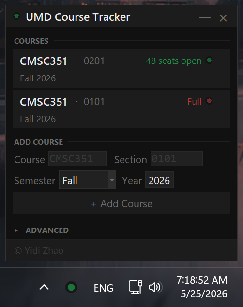
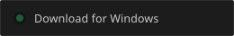

<div align="center">

# UMD Course Tracker

A lightweight Windows tray app that monitors UMD Testudo seat availability<br/>
and alerts you the moment a seat opens.

<br/>



<br/><br/>

<a href="https://github.com/Yidiiiz/UMD-Course-Tracker/releases/latest/download/UMDCourseTracker.exe">
  
</a>

<sub>Windows 10 &amp; 11 &nbsp;·&nbsp; No installation required &nbsp;·&nbsp; No Python needed</sub>


</div>

<br/>

---

## Overview

UMD Course Tracker lives in your taskbar as a single colored dot — green when seats are
open, red when every tracked section is full. It is built to be a persistent, at-a-glance
indicator rather than a background process you forget about.

- **Tray-first design** — status is visible without opening anything
- **Desktop notifications** the moment a section opens (or closes, if enabled)
- **Multiple courses and sections**, tracked across any term
- **Automatic light / dark theme**, following Windows
- **Self-contained** — a single `.exe`, no Python or installer required

## Installation

Download `UMDCourseTracker.exe` from the link above and double-click it. The app starts
in the system tray; no installer runs and nothing is written next to the executable.

> [!NOTE]
> Windows may show a **"Windows protected your PC"** SmartScreen prompt because the app is
> not code-signed (a certificate costs roughly $200/year). Choose **More info → Run anyway**.
> The complete source is available in this repository.

## Usage

Left-click the tray icon to open the panel, enter a course ID such as `CMSC351`, pick a
semester, then click **+ Add Course**. The section field is optional — leave it blank to
track every section of the course.

| Action | How |
|:---|:---|
| Open the panel | Left-click the tray icon |
| Add a course | Enter a course ID → choose a semester → **+ Add Course** |
| Remove a course | Hover a card → click **×** |
| Open on Testudo | Click anywhere on a course card |

| Tray icon | Meaning |
|:---|:---|
| 🟢 Green | Seats open |
| 🔴 Red | All tracked sections full |
| 🟡 Yellow | Checking |

## Settings

Expand **Advanced** at the bottom of the panel.

| Setting | Default | Notes |
|:---|:---|:---|
| Poll interval | `60 s` | Minimum 30 s |
| Notify when a section closes | Off | Open-seat alerts are always on |
| Open on Windows startup | On | Managed via the current-user registry |
| Theme | System | Follows Windows light / dark mode |

Courses and settings are stored in `%APPDATA%\UMD Course Tracker\` — never alongside the
executable — so the app can be moved or updated freely.

## Term Codes

The app selects the next upcoming semester automatically; you can override it when adding
a course. Term codes are shown here for reference.

| Code | Semester |
|:---|:---|
| `202601` | Spring 2026 |
| `202605` | Summer 2026 |
| `202608` | Fall 2026 |
| `202612` | Winter 2027 |

A term code is the calendar year followed by the season month (`01` Spring, `05` Summer,
`08` Fall, `12` Winter). Winter terms begin in December of the preceding year.

## Build from Source

Requires Python 3.9+ on Windows.

```bat
git clone https://github.com/Yidiiiz/UMD-Course-Tracker.git
cd "UMD-Course-Tracker\UMDCourseTracker"

setup.bat          :: install dependencies
python tracker.py  :: run from source
build.bat          :: produce dist\UMDCourseTracker.exe
```

**Dependencies:** `requests` · `beautifulsoup4` · `pystray` · `Pillow` · `plyer` · `pyinstaller`
